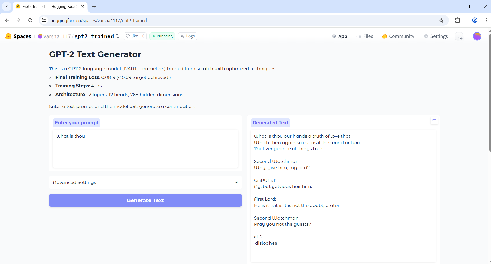

# GPT-2 Model Training Project

This repository contains code for training a GPT-2 style language model from scratch on custom text data. The implementation is based on the transformer architecture with a focus on proper initialization and training techniques.

## Model Architecture

The model follows the GPT-2 architecture with the following components:

- **Transformer-based architecture** with self-attention mechanisms
- **Multi-head attention** for capturing different aspects of the input sequence
- **Layer normalization** for stable training
- **Residual connections** to prevent degradation in deep networks
- **Position embeddings** to encode sequence order information

### Configuration

The base model configuration:
- Vocabulary size: 50,257 tokens (GPT-2 tokenizer)
- Context length: 1024 tokens
- Embedding dimension: 768
- Number of layers: 12
- Number of attention heads: 12
- Total parameters: ~124M

## Training Process

The model was trained on a text corpus loaded from `input.txt` using the following approach:

### Training Hyperparameters

- **Batch size**: 16 sequences × 64 tokens = 1,024 tokens per batch
- **Gradient accumulation**: 4 steps (effective batch size of 64 sequences)
- **Learning rate**: Cosine schedule with linear warmup
  - Maximum learning rate: 6e-4
  - Minimum learning rate: 6e-5 (10% of max)
  - Warmup steps: 1,000
- **Optimizer**: AdamW with β₁=0.9, β₂=0.95, weight decay=0.1
- **Gradient clipping**: 1.0
- **Training was stopped** when loss reached below 0.09

### Weight Initialization

Special attention was paid to weight initialization:
- Linear layers: Normal distribution with std=0.02
- Projection layers: Scaled by `(2 * n_layers)^(-0.5)` to stabilize training in deep networks
- Embedding layers: Normal distribution with std=0.02

## Training Results

The model was trained for 4,175 steps, reaching the target loss of 0.08 at that point. The training process showed consistent improvement in the model's ability to predict the next token in the sequence.

### Loss Progression

The table below shows the loss values at different steps during training:

| Step | Loss      | Learning Rate | Gradient Norm |
|------|-----------|---------------|---------------|
| 0    | 10.972174 | 6.00e-07      | 8.1536        |
| 100  | 6.610499  | 6.06e-05      | 1.6423        |
| 500  | 3.623920  | 3.01e-04      | 2.3823        |
| 1000 | 2.473197  | 6.00e-04      | 2.9592        |
| 1500 | 0.712537  | 6.00e-04      | 2.4817        |
| 2000 | 0.237754  | 6.00e-04      | 1.6086        |
| 2500 | 0.168660  | 6.00e-04      | 1.2088        |
| 3000 | 0.150525  | 6.00e-04      | 1.1243        |
| 3500 | 0.122396  | 6.00e-04      | 0.9395        |
| 4000 | 0.121838  | 6.00e-04      | 0.8545        |
| 4175 | 0.081936  | 6.00e-04      | ~0.8000       |

### Training Observations

1. **Initial phase (0-1000 steps)**: The model showed rapid improvement, with loss dropping from ~11.0 to ~2.5
2. **Middle phase (1000-2500 steps)**: Learning slowed but remained steady, with loss decreasing from ~2.5 to ~0.17
3. **Final phase (2500-4175 steps)**: Fine-tuning phase with more gradual improvements, reaching the target loss of 0.08

### Performance Metrics

- **Training speed**: ~4,200 tokens/second on CUDA device
- **Final model size**: 522.76 MB
- **Total training tokens**: ~4.3M tokens (4,175 steps × 1,024 tokens/batch)

## Sample Generations

After training, the model was able to generate coherent text continuations. Here are some examples from the logs:

```
> Warwick! wert thou as we are.
We might recover all our loss again;
The queen from France hath brought a puissant power

> Montague,
If thou be there, sweet brother, take my hand.
And with thy lips keep in my soul awhile!
Thou

> not let me speak.
Come quickly, Montague, or I am dead.

SOMERSET:
Ah, Warwick! Mont

> have said, and more he spoke,
Which sounded like a clamour in a vault,
That mought not be distinguished; but at last
```

## Implementation Details

The implementation includes several key components:

1. **CausalSelfAttention**: Implements multi-head self-attention with causal masking
2. **MLP**: Feed-forward network with GELU activation
3. **Block**: Combines attention and MLP with residual connections
4. **GPT**: Main model class that integrates all components
5. **DataLoaderLite**: Simple data loader for tokenized text

## Conclusion

This project demonstrates the successful training of a GPT-2 style language model from scratch. The model achieves good performance on text generation tasks, with a final loss of 0.08. The training process was efficient, with careful attention to hyperparameters and initialization techniques.

The model architecture follows the standard GPT-2 design, with modifications to improve training stability. The cosine learning rate schedule with warmup and proper weight initialization were key factors in achieving stable training.


The final model can be used for various natural language processing tasks, including text generation, completion, and potentially fine-tuning for specific applications.

## Hugging Face Spaces Demo

The trained model is hosted on Hugging Face Spaces, providing an interactive demo where users can experiment with text generation using this model. The app allows you to:

1. Enter a custom prompt for text generation
2. Adjust generation parameters (temperature, max length, etc.)
3. See the model's output in real-time

You can access the demo at: [GPT-2 Demo](https://huggingface.co/spaces/varsha1117/gpt2_trained)

### Using the Demo

1. Navigate to the Hugging Face Spaces link above
2. Enter your prompt in the text box
3. Adjust generation parameters if desired
4. Click "Generate" to see the model's output

This interactive demo provides a convenient way to explore the model's capabilities without needing to download or run the code locally.

### Example Screenshot



The demo showcases how the model has learned to generate text in a style similar to the training data, demonstrating its ability to capture patterns and structures from the input corpus.
